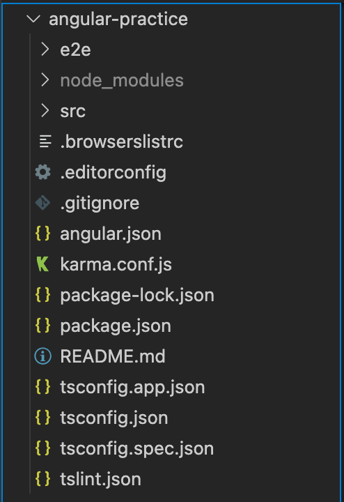

# Angular

Angular由组件构成，一个组件包含：
1. 一个HTML模版
2. 一个Typescript类
3. 一个CSS样式（可选）

# Angular Cli

创建组件需要Angular Cli（脚手架）。

安装Angular Cli：
```
npm install -g @angular/cli
```

查看Angular Cli版本：
```
ng version
```

# 初始化项目

使用ng指令创建Angular项目。
```
ng new angular-practice
```
生成的项目会有如下结构：



src目录下会生成一个app组件：


1. app-routing.module.ts 路由
2. app.component.css 样式
3. app.component.html 模版
4. app.component.spec.ts 单元测试文件
5. app.component.ts 组件文件
6. app.module.ts 配置文件


使用ng指令启动项目：
```
ng serve
```
映入眼帘的第一个画面就是app.component.html

<div style="text-align:center"></div>

# 制作主页

按照工业标准，不把app.component.html作为用户看到的第一个画面。（虽然它作为项目的根目录，是进入的第一个组件，这一般不会改变）。

一般会把app component设置为空白画面，仅用于预加载可在全局生效的功能。

采用如下结构：

<div style="text-align:center"></div>

用户一开始进入的的确是app component，随后立刻跳转到page01。因为这个过程很短而且app component画面又是空白的，用户会感觉自己首先进入的就是page01。

>这样做另一个好处是，当未来想要更换初始画面时，不需要对app component再进行修改。

## 新建index

新建组件：
```
ng generate component index
```

把app.component.html中的HTML全部拷到index.component.html，style内容全部拷到app.component.css。

只留下\<router-outlet>\</router-outlet>标签。

>路由出口：RouterOutlet 是一个来自路由器库的指令，虽然它的用法像组件一样。它充当占位符，用于在模板中标记出路由器应该显示把该组件显示在那个出口的位置。

<!-- ## 新建工程目录

新建business文件夹用于存放工程的其它组件。使其和app组件分隔开，让目录更加清晰。

1. 新建“business”。


2. 在里面新建PAGE01X文件夹用于存放第一套连续的画面，并新建business.module.ts和PAGE01X.module.ts。


这两个配置文件用来配置路由和声明Angular API。 -->

# 单页面应用的页面跳转

Angular是单页面应用，通过显示或隐藏特定组件的显示部分来改变用户能看到的内容。画面之间的跳转，实质上是HTML页面内标签的替换。为了处理从一个画面到另一个画面的导航，需要使用Angular的Router（路由器）。路由器会把浏览器URL解释成改变视图的操作指南，以完成导航。

在这个项目中，这个单一画面是angular-practice/src/index.html。

index.html内的内容会一直显示，但我们可以将它设置成空白，只留下\<router-outlet>\</router-outlet>标签。这个标签会通知 Angular，将所选路由的组件更新到视图这个标签。


# 配置路由

使用ng生成的组件会被自动添加到app.module.ts
```typescript
@NgModule({
  declarations: [AppComponent, IndexComponent],
  imports: [BrowserModule, AppRoutingModule],
  providers: [],
  bootstrap: [AppComponent],
})
export class AppModule {}
```
不过还需要在app-routing.module.ts的routes里添加路径：
```typescript
const routes: Routes = [
  { path: 'index', component: IndexComponent },
];

@NgModule({
  imports: [RouterModule.forRoot(routes)],
  exports: [RouterModule],
})
export class AppRoutingModule {}
```

# 修改主页

有了第一个主页，就可以对里面的内容进行修改了。

<div style="text-align:center"></div>

这是Angular默认生成的页面，采用了响应式布局。如果为了节省时间，可以直接拿过来使用。

但是这里我想尝试一下最近很火的前端框架。

# 选择前端CSS框架

目前很火的框架有两个：element ui和ant design。（不知道为什么近些年bootstrap渐渐不火了）

element ui为Angular提供的最后更新是2018-02-23：


Ant design为Angular提供的最后更新是2021-01-18:


所以我选择了Ant design为Angular提供的CSS库：NG-ZORRO

>ng-zorro-antd 是遵循 Ant Design 设计规范的 Angular UI 组件库，主要用于研发企业级中后台产品。全部代码开源并遵循 MIT 协议，任何企业、组织及个人均可免费使用。

## 安装NG ZORRO

为了防止翻车，我切了一个单独的git分支：antd。

引入ng zorro包

```
ng add ng-zorro-antd
```

下面的配置文件会被自动修改：


这时切到terminal，发现报错了：


这是因为HttpClientModule和BrowserAnimationsModule两个模块缺失。

control+C停止项目，npm install一下再ng serve。

现在没有问题了。启动项目，发现我的主页被替换成了下面这个：


就你可以发现ng zorro很坏很坏的，替换了主页也不跟你说一声。检查一下app.component.html，发现：


router-outlet都被替换了，那画面自然是显示不出来的。先让这份文件回退，然后我们来看看ng zorro要怎么使用：

国际化一章说明了日期的设定，并建议使用date-fns并且移除掉对Angular Locales包的依赖（删除下方代码）来减小打包体积。（这个可以在项目结束后再考虑）

服务端渲染是一种SSR技术。标准的 Angular 应用会运行在浏览器中，它会在 DOM 中渲染页面，以响应用户的操作。 而Angular Universal 会在服务端运行，生成一些静态的应用页面，稍后再通过客户端进行启动。 这意味着该应用的渲染通常会更快，让用户可以在应用变得完全可交互之前，先查看应用的布局。

都先不管，

# 以上内容截止至2020年5月4日


